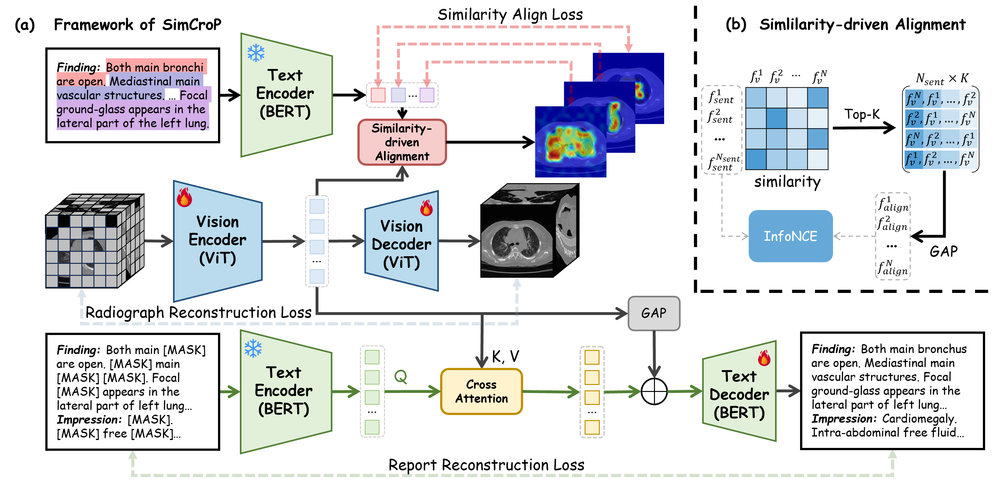

# SimCroP: Radiograph Representation Learning with Similarity-driven Cross-granularity Pre-training




<div align="center">
    <span class="author-block">
    <a href="https://scholar.google.com/citations?user=rYP1nFEAAAAJ&hl=en" target="_blank">Rongsheng Wang</a><sup>1,2,6*</sup>,</span>
    <span class="author-block">
    <a href="https://scholar.google.com/citations?user=x1pODsMAAAAJ&hl=en" target="_blank">Fenghe Tang</a><sup>1,2*</sup>,</span>
    <span class="author-block">
    <a href="https://scholar.google.com/citations?user=CMiRzlAAAAAJ&hl=en" target="_blank">Qingsong Yao</a><sup>3</sup>,</span>
    <span class="author-block">
    <a href="https://scholar.google.com/citations?user=_focNJ4AAAAJ&hl=en" target="_blank">Rui Yan</a><sup>1,2†</sup>,</span>
    <span class="author-block">
    <a href="https://scholar.google.com/citations?user=6-NiSKYAAAAJ&hl=en" target="_blank">Xu Zhang</a><sup>1,2,6</sup>,</span>
    <span class="author-block">
    <a href="https://scholar.google.com/citations?user=3quAMXcAAAAJ&hl=en" target="_blank">Zhen Huang</a><sup>2</sup>,</span>
    <span class="author-block">
    <a href="https://scholar.google.com/citations?user=y4RUE_YAAAAJ&hl=en" target="_blank">Haoran Lai</a><sup>1,2,6</sup>,</span>
    <span class="author-block">
    <a target="_blank">Zhiyang He</a><sup>6</sup>,</span>
    <span class="author-block">
    <a target="_blank">Xiaodong Tao</a><sup>6</sup>,</span>
    <span class="author-block">
    <a href="https://scholar.google.com/citations?user=Wo8tMSMAAAAJ&hl=en" target="_blank">Zihang Jiang</a><sup>1,2†</sup>,</span>
    <span class="author-block">
    <a href="https://scholar.google.com/citations?user=8eNm2GMAAAAJ&hl=en" target="_blank">S. Kevin Zhou</a><sup>1,2,4,5†</sup>
    </span>
</div>
<div align="center">
    <p><sup>*</sup>Equal contribution. <sup>†</sup>Corresponding author.</p>
</div>


<br>

<div align="center">
    <sup>1</sup>
    <a target='_blank'>School of Biomedical Engineering, University of Science and Technology of China</a>&emsp;
    <br>
    <sup>2</sup> <a target='_blank'>Suzhou Institute for Advanced Research, University of Science and Technology of China</a>&emsp;
    <br>
    <sup>3</sup> <a target='_blank'>Stanford University, Palo Alto, CA, 94025, United States</a>&emsp;
    <br>
    <sup>4</sup> <a target='_blank'>Jingsu Provincial Key Laboratory of Multimodal Digital Twin Technology, Suzhou Jiangsu, 215123, China</a>&emsp;
    <br>
    <sup>5</sup> <a target='_blank'>Key Laboratory of Precision and Intelligent Chemistry, USTC, Hefei Anhui, 230026, China</a>&emsp;
    <br>
    <sup>6</sup> <a target='_blank'>Anhui IFLYTEK CO., Ltd.</a>
    <br>
</div>

<br>
<br>

**News** 🥰:

- SimCroP is accepted by MICCAI 2025! 🎉

## Installation
Install Python dependencies:
```
conda env create -f environment.yml
```


## Data Processing
- Download [CT-Rate](https://huggingface.co/datasets/ibrahimhamamci/CT-RATE), [RadChestCT](https://cvit.duke.edu/resource/rad-chestct-dataset/), [CC-CCII](https://www.kaggle.com/datasets/fakaframe082/cc-ccii), [LUNA16](https://luna16.grand-challenge.org/Data/), and [BTCV](https://figshare.com/articles/dataset/BTCV_dataset/29077214) dataset.
- Preprocess datasets using the *data preprocess codes* offered by [CT-CLIP](https://github.com/ibrahimethemhamamci/CT-CLIP/tree/main/data_preprocess).


## Pre-training
Pre-training code is still under processing.

Our pre-trained model weight can be found [here](https://drive.google.com/file/d/1CuL99ABmEJrX5XVG0h5nQ_kzAaJmYp2a/view?usp=drive_link) for evaluating.


## Fine-tuning
We perform linear probing classification and fine-tuning segmentation for downstream tasks.

### Linear probing classification
We evaluate linear probing classification performance of our model using this command:
```
CUDA_VISIBLE_DEVICES=3 python train.py --name simcrop --stage train --model vit_base_patch16 --task CT-Rate --num_classes 18 \
    --pretrained_path $PATH_TO_SimCroP_CHECKPOINT \
    --dataset_path $PATH_TO_CTRATE \
    --output_dir "output/CT-Rate/SimCroP/1/" --data_volume '1' --num_steps 2000  --eval_batch_size 48 \
    --learning_rate 1.5e-3 --warmup_steps 150 --fp16 --fp16_opt_level O2 --train_batch_size 32 \
    --patience 10
```

You can change `--task` to set specific dataset for fine-tuning classification. 4 datasets are available: CT-Rate, RadChestCT, CC-CCII, and LUNA16. The `--data_volume` parameter can be set to identify the fraction of training data.

### Segmentation
We evaluate fine-tuning segmentation performance of our model using this command:
```
CUDA_VISIBLE_DEVICES=7 python main.py --pretrained_path "../checkpoints/simcrop.pth" --output_dir "./output/LUNA16/simcrop" --out_channels 4 \
    --space_x 1.0 --space_y 1.0 --space_z 1.0 --json_path "dataset_10.json" \
    --task LUNA16 --data_dir $PATHTOLUNA16 --max_epochs 400  --val_every 20 \
    --batch_size 1 --sw_batch_size 1
```

You can change `--task` to set specific dataset for segmentation, where 2 datasets are available: LUNA16 and BTCV. The `--data_volume` parameter can be set to identify the fraction of training data.


## Acknowledgement
Some codes are borrowed from [ECAMP](https://github.com/ToniChopp/ECAMP/tree/main) and [UNETR](https://github.com/tamasino52/UNETR).


## Citation
If the code, paper and weights help your research, please cite:
```
@article{wang2025simcrop,
  title={SimCroP: Radiograph Representation Learning with Similarity-driven Cross-granularity Pre-training},
  author={Wang, Rongsheng and Tang, Fenghe and Yao, Qingsong and Yan, Rui and Zhang, Xu and Huang, Zhen and Lai, Haoran and He, Zhiyang and Tao, Xiaodong and Jiang, Zihang and Zhou, S Kevin},
  howpublished={\url{https://github.com/ToniChopp/SimCroP}},
  year={2025}
}
```


## License
This project is released under the Apache 2.0 license. Please see the [LICENSE](LICENSE) file for more information.